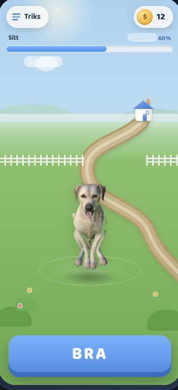

## Phase 6 — Training-page visual enhancement (juice & ambiance)

Implement the design system bra (html file). For all aspects of game, menu training page visuals etc. Build the system in godot so its easy to keep building the games UI with the design system.

### Goal — reach this state

The training page should read like this: coin balance + «Triks» in a clean rounded HUD, the
learned-bar under the trick label, the dog **centered and grounded** on a stylized garden (textured
grass, horizon, path to the house, fence), and a big rounded **BRA** button anchored at the bottom.
This is the visual target the design-system work (above) builds toward — match the **composition,
grounding, and juice**, not the exact pixels.
